# BookManagementSystem
A website for book managing work.
## Functionalities
- Create and attach Roles for Users.
- Create Categories.
- Create Authors with Categories.
- Create Books with Authors and Categories.
- Read a Book.
- Buy A Print of a Book (haven't implemented yet).
- Searched by name, description, or category.
## Previews
### HomePage

### Login
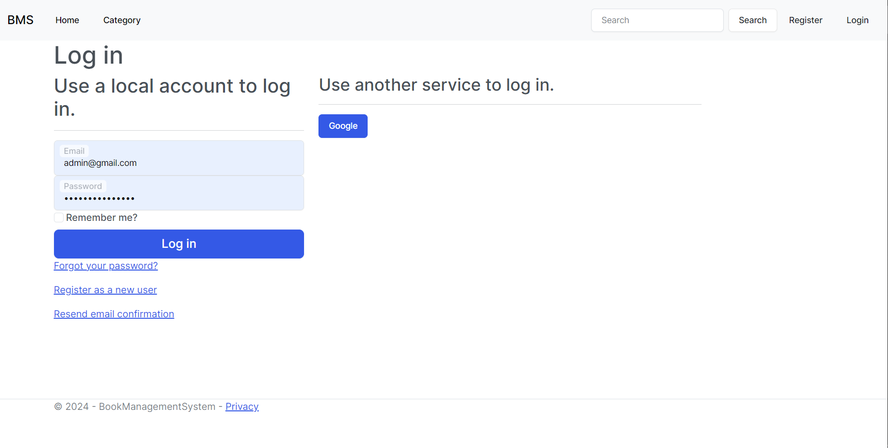
### Register
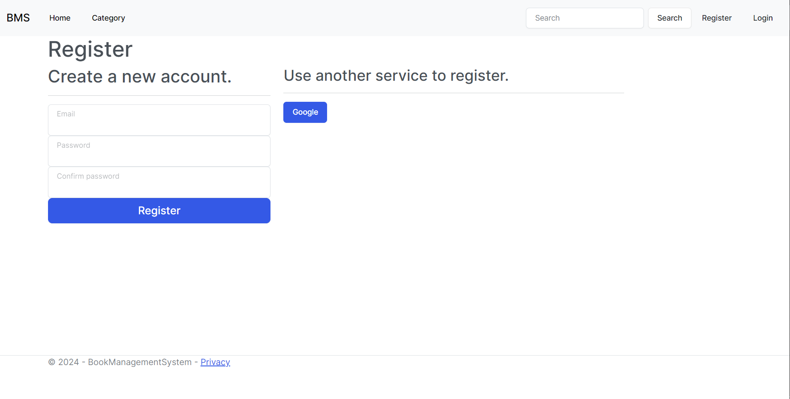
### HomePage For Admin
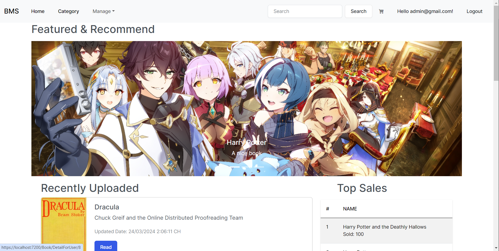
### Manage User
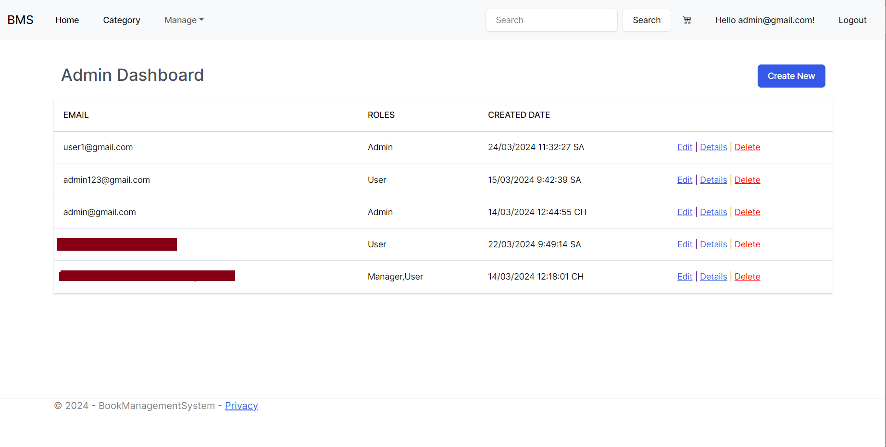
### Manage Book
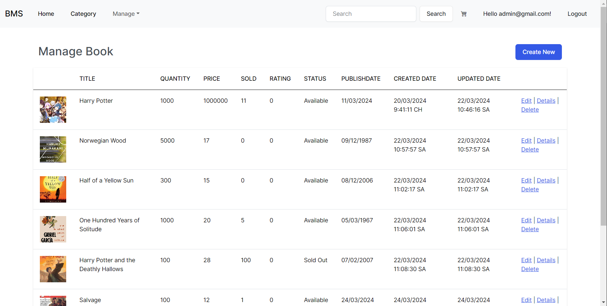
### Manage Author
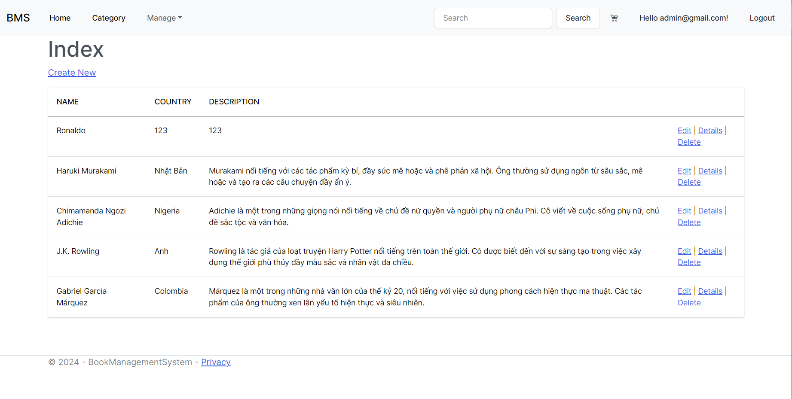
### Manage Category
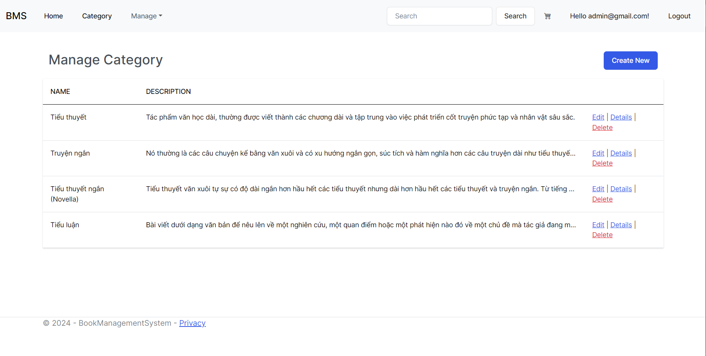
### Create A New Book
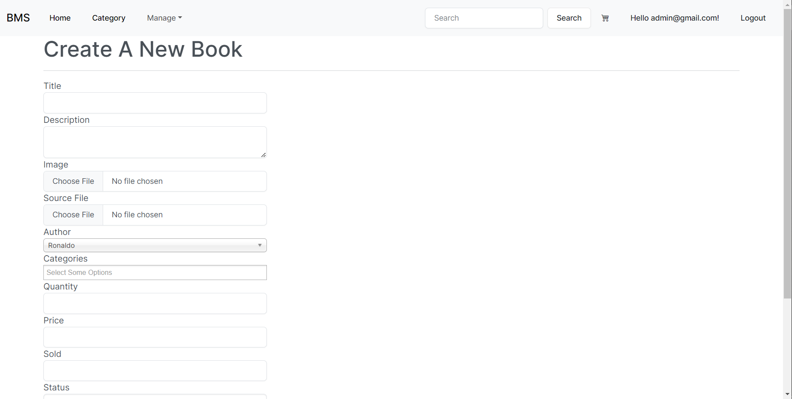
### Detail Of A Book 
 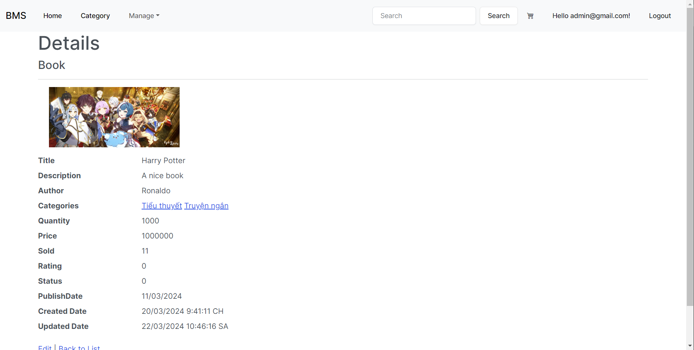
### Edit A Book
 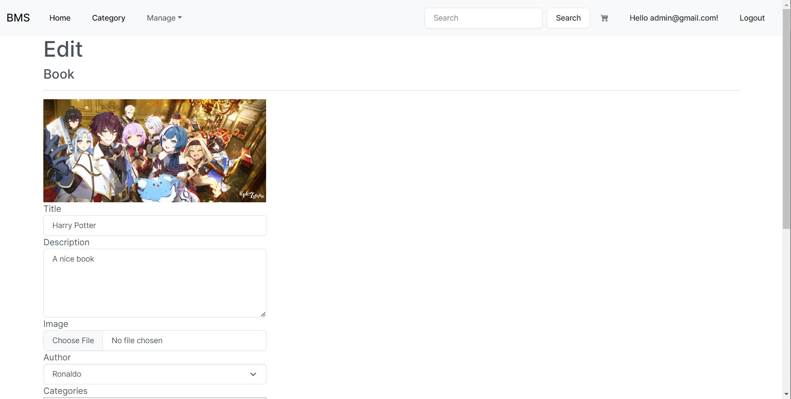
### Delete A User
 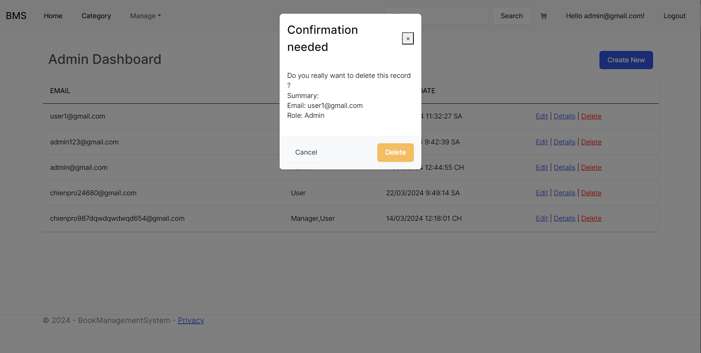
### Book Details For User 
 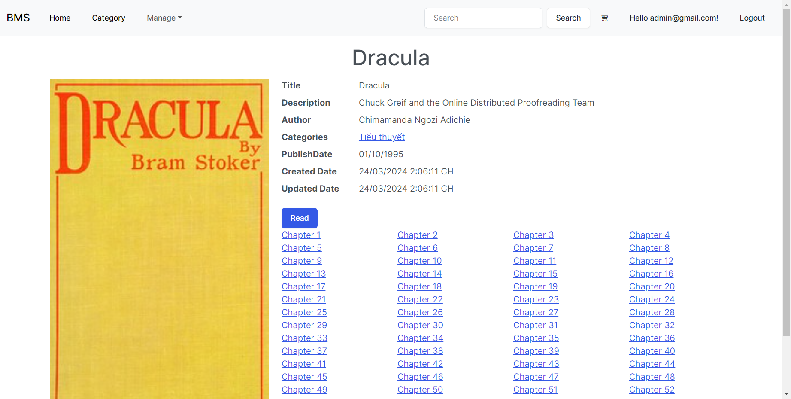
### Read A Book
 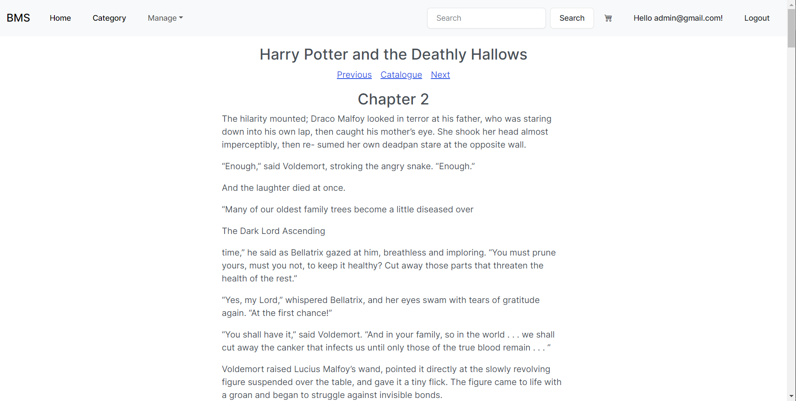
### Search Page
 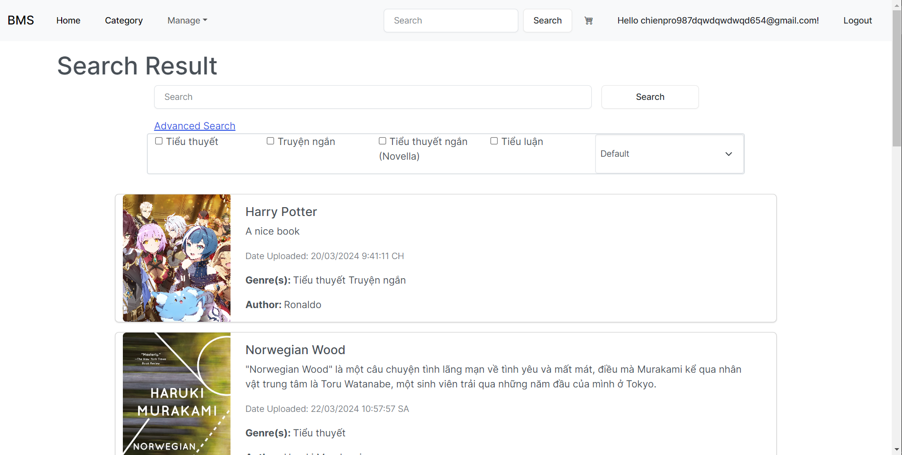
### Searched By Name
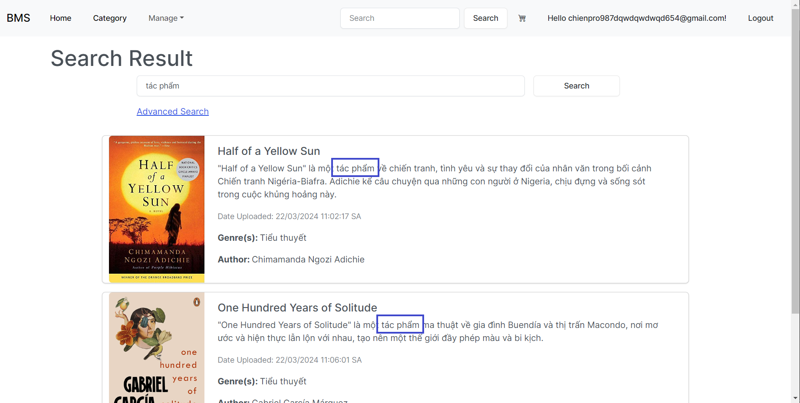
 ### Search By Description
.png)
### Searched By Category
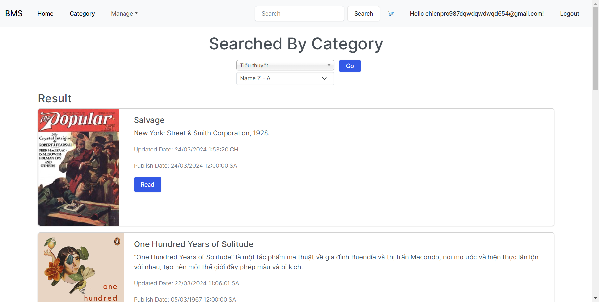
